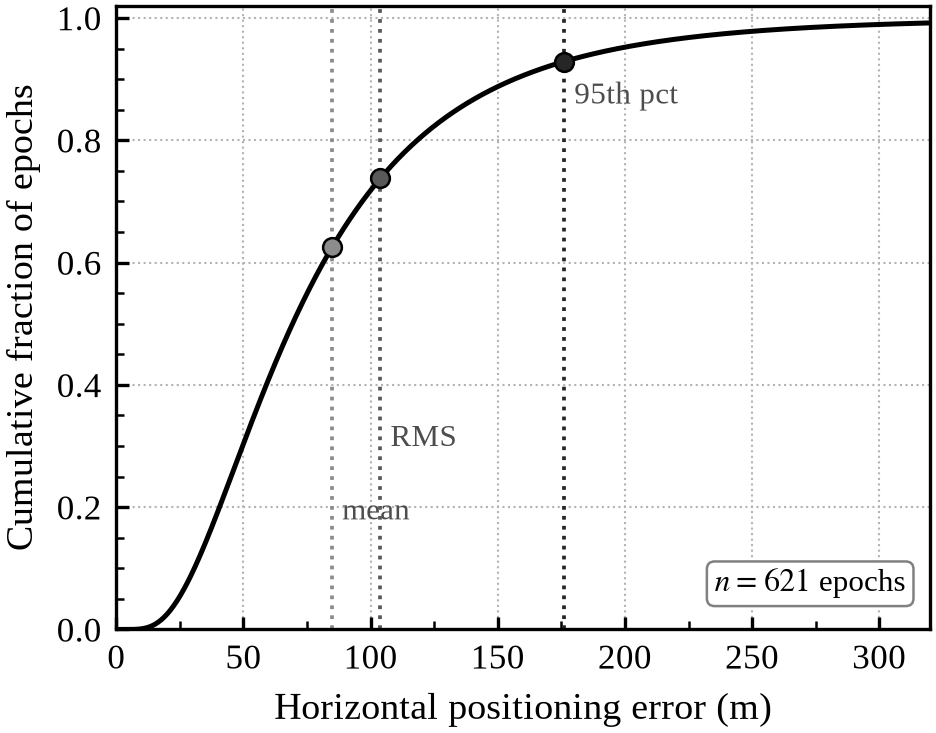
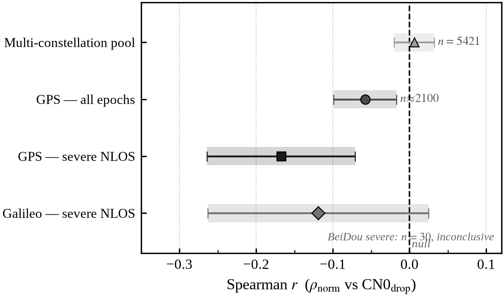

# Quantifying the LiDAR-Reflectance Contribution to GNSS NLOS Pseudorange Error: A Within-Satellite Analysis with Methodological Cautions

> 草稿 v0.4 — 数值取自本项目 UrbanNav-HK-Medium-Urban-1 实测（脚本
> step6e/6f/6g/6h/8d/8e/8f/8g/8h/9a）。
> v0.4 改动：风格重构（段落化、删 Takeaway、收紧贡献条目、合并 §4.3/4.4、
> 标题去口号化、摘要去加粗），并补入图 4（SPP 误差分布）与图 5（反射率分层）。

---

## 摘要

城市峡谷中的非视距（NLOS）信号是 GNSS 定位误差的主要来源。近年大量工作借助
车载 LiDAR 的三维结构与反射强度来预测或改正 NLOS 观测，其物理假设是：表面反射
特性越强，反射信号能量越大、伪距偏差越大。本文以一段香港城市峡谷数据
（UrbanNav Medium-Urban-1；u-blox F9P 多星座接收机 + 同步 LiDAR）严格检验
这一假设。我们构造距离平方与入射角补偿的归一化反射率 ρ_norm，并以
香港 CORS 参考站 HKSC 为基准的双差残差作为伪距误差的干净观测标签。
逐层剥离混淆变量后，朴素的跨卫星相关接近零；一个 AUC=0.906 的 NLOS 分类器
其判别力几乎完全来自卫星仰角，而非 LiDAR 特征；将 LiDAR 特征对仰角残差化后，
随机 K 折交叉验证给出 AUC=0.748，而按卫星分组交叉验证下塌至 0.533，差距 0.215
即时序自相关造成的泄漏。在控制卫星身份的星内去均值估计下，反射率与几何路径
长度与实测伪距误差呈显著但微弱的关联（ρ_norm: Spearman=−0.075；ΔL: −0.069；
均 p<0.001；5 历元时序平滑后增至 −0.10～−0.12；R² 仅 1.4%）。我们由此勾勒
材质衰减建模的可行性边界，并讨论将该信号提升至可用强度所需的受控材质采集与
传感器级反射率标定。

**关键词**：GNSS NLOS、LiDAR 反射率、材质衰减、城市峡谷、双差观测、
星内分析、交叉验证泄漏

## Abstract

Non-line-of-sight (NLOS) reception dominates the GNSS error budget in dense
urban canyons. A growing body of work uses vehicle-borne LiDAR — its three-
dimensional structure and surface reflectance — to predict or correct NLOS
measurements, on the implicit assumption that stronger surface reflectance
maps to greater signal attenuation and larger pseudorange bias. Using a
Hong Kong urban-canyon dataset (UrbanNav Medium-Urban-1; u-blox F9P
multi-constellation receiver with synchronized LiDAR), we evaluate this
material-attenuation hypothesis under a protocol designed to strip confounders.
A normalized LiDAR reflectance ρ_norm with range² and incidence-angle
compensation is computed per return, and double-difference (DD) residuals
against the Hong Kong CORS reference station HKSC provide a measurement-domain
NLOS label that cancels receiver and satellite clocks. Naive cross-satellite
correlations between reflectance and DD residual are near zero. A classifier
that reports AUC = 0.906 on the DD-defined NLOS label is shown, by ablation,
to derive almost all of its discrimination from satellite elevation rather than
from LiDAR features. After residualizing LiDAR features on elevation, random
K-fold cross-validation reports AUC = 0.748, while satellite-grouped
cross-validation collapses to 0.533; the 0.215 gap is autocorrelation leakage.
A within-satellite, de-meaned estimator that controls for satellite identity
reveals a genuine but small association between reflectance, geometric path
length and measured pseudorange error (ρ_norm: Spearman = −0.075; ΔL = −0.069;
both p < 0.001; rising to −0.10 to −0.12 under 5-epoch temporal smoothing;
R² ≈ 1.4 %). We use these results to map the feasibility boundary of
material-attenuation modeling and to identify the controlled-material capture
and sensor-level reflectance calibration that would be required to raise the
signal to a usable level.

**Keywords:** GNSS NLOS; LiDAR reflectance; material attenuation; urban
canyon; double difference; within-satellite estimator; cross-validation leakage.

---

## 1. Introduction

GNSS single-point positioning (SPP) in dense urban canyons is dominated by
non-line-of-sight reception, in which the direct path to a satellite is
blocked and the receiver tracks a reflected or diffracted signal instead.
On the dataset used in this study, weighted least-squares SPP yields a mean
horizontal error of 84.8 m, a root-mean-square error of 103.8 m, and a 95th
percentile of 176.1 m against a tactical-grade ground truth, consistent with
the 50–200 m range reported for GNSS-only positioning in dense Hong Kong
canyons. Closing this gap requires either receiver-level signal processing
or, increasingly, the use of external sensors that observe the environment
in which the NLOS path is generated.

Vehicle-borne LiDAR is an attractive auxiliary sensor because it returns both
the three-dimensional geometry that determines whether a sky direction is
occluded and the per-return intensity that, after compensation for range and
incidence angle, encodes the reflective properties of the surface intercepted
by the ray. The intuitive physical chain is direct: glass, metal and other
specular façades return strong reflections; the reflected ray is the one the
receiver tracks when the direct path is blocked; therefore stronger LiDAR
reflectance should predict which satellites are NLOS and by how much their
pseudoranges are biased. Most prior LiDAR-aided NLOS work exploits the
geometric half of this chain through ray-casting into a 3-D map, and reports
favourable classification or positioning results. Far less work has isolated
the reflectance half of the chain in a confounder-controlled manner, quantified
its effect size on measurement-domain error, or audited the cross-validation
protocol for the temporal-autocorrelation leakage that random splits on
GNSS time series readily introduce.

This paper provides such an isolation. We pose three contributions.
First, a reproducible pipeline normalizes raw LiDAR intensity into a
material-proxy reflectance ρ_norm, aligns it per epoch and per satellite with
GNSS observables, and uses double-difference residuals against a CORS
reference station as a clean measurement-domain NLOS label that bypasses the
single-receiver clock-estimation failure we document for this dataset.
Second, a within-satellite, de-meaned estimator isolates a genuine but small
physical association between reflectance, geometric path length and measured
pseudorange error (p < 0.001 with R² ≈ 1.4 %) where the corresponding
cross-satellite correlation is near zero. Third, we document and quantify
two confounds that inflate apparent performance in this problem: an elevation
confound under which an AUC = 0.906 classifier is shown to be essentially
all elevation, and a temporal-autocorrelation cross-validation leakage that
inflates AUC by approximately 0.215 when random K-fold is used in place of
satellite-grouped splits.

## 2. Related Work

### 2.1 Geometry-Based NLOS Exclusion: Shadow Matching and 3DMA-GNSS

The dominant approach to urban NLOS mitigation uses 3-D city models to predict
satellite visibility by ray-casting. Groves (2011) introduced *shadow
matching*, in which positioning is constrained by whether each satellite is
predicted blocked or visible in a building model [Groves, "Shadow matching: A
new GNSS positioning technique for urban canyons," J. Navigation 64(3):
417–430, 2011]. Hsu, Gu & Kamijo (2016) developed a 3-D-building-model-based
positioning method for multi-constellation pedestrians, including a reliability
calculation that exploits the predicted visibility [GPS Solutions 20(3):
413–428, 2016; DOI 10.1007/s10291-015-0451-7]. The shadow-matching family was
later generalized to 3D Mapping Aided GNSS (3DMA), which additionally corrects
pseudoranges using predicted NLOS path excess [Adjrad & Groves, "Intelligent
Urban Positioning: Integration of Shadow Matching with 3D-Mapping-Aided GNSS
Ranging," J. Navigation 71(1): 1–20, 2018; DOI 10.1017/S0373463317000509].
These works establish that satellite geometry (blocked vs. visible;
approximate ΔL) can be inferred from a map. What they do not address is
whether LiDAR surface reflectance adds information beyond geometry — the
question this paper isolates.

Vehicle-borne LiDAR has been used by the Hong Kong PolyU group to detect and
exclude NLOS signals in real time: Wen, Zhang & Hsu (2021) cast satellite
lines of sight into a dynamically built LiDAR point cloud and exclude
predicted NLOS observations from the SPP solution, demonstrating positioning
improvement in urban canyons [Wen, Zhang & Hsu, "GNSS NLOS Exclusion Based on
Dynamic Object Detection Using LiDAR Point Cloud," IEEE Trans. Intell. Transp.
Syst. 22(2): 853–862, 2021; DOI 10.1109/TITS.2019.2961128]. Ng, Zhang, Luo &
Hsu (2021) further demonstrated dual-frequency (L1/L5) 3DMA on smartphone
data, with the building model used both for signal selection and for
pseudorange correction [Ng, Zhang, Luo & Hsu, "Urban positioning: 3D mapping-
aided GNSS using dual-frequency pseudorange measurements from smartphones,"
NAVIGATION 68(4): 727–749, 2021; DOI 10.1002/navi.448]. A companion study by
Ng, Zhang & Hsu (2021) applied shadow matching to smartphone observables
[Ng, Zhang & Hsu, "Robust GNSS Shadow Matching for Smartphones in Urban
Canyons," IEEE Sensors J. 21(16): 18307–18317, 2021;
DOI 10.1109/JSEN.2021.3083801]. These papers treat LiDAR or the 3-D map as a
geometric occlusion detector and demonstrate that structural information is
useful. In contrast, our step8d result — F1 = 0.27, 83 % false positive rate
when comparing LiDAR-geometric NLOS flags to DD-measured pseudorange error —
suggests that geometric NLOS detection does not imply pseudorange bias, and
motivates the separate question of whether reflectance adds a
material-attenuation signal.

### 2.2 Machine-Learning NLOS Classification from GNSS Observables

Beyond geometric occlusion, several groups have applied machine learning to
GNSS observables to classify NLOS satellites directly. Ozeki & Kubo (2022)
combined pseudorange-residual checks with machine learning on signal-level
features (C/N0, elevation, pseudorange residuals) to classify NLOS satellites
[Ozeki & Kubo, "GNSS NLOS Signal Classification Based on Machine Learning and
Pseudorange Residual Check," Frontiers in Robotics and AI 9: 868608, 2022;
DOI 10.3389/frobt.2022.868608]. Li, Elhajj, Feng & Ochieng (2023) report a
comparative experiment on machine-learning-based GNSS signal classification
and weighting-scheme design in the built environment, finding random forest
the strongest classifier in their setting [Satellite Navigation 4, 2023;
DOI 10.1186/s43020-023-00101-w].

These classification studies share a common evaluation pattern: they report
high AUC or F1 on a test split, and in several cases that split is drawn
randomly from a time-series dataset — exactly the temporal autocorrelation
leakage scenario we identify and quantify in §4.3. Grouped evaluation (e.g.
by satellite or by time block) is rarely reported. Our step8h result —
residual-LiDAR RF AUC drops from 0.748 (random K-fold) to 0.533
(satellite-grouped) — illustrates how much this protocol choice affects
reported performance.

### 2.3 NLOS Pseudorange Error Models

A complementary line of work models the magnitude of NLOS pseudorange bias
rather than only classifying it. Adjrad & Groves (2018) derive expected NLOS
path excess as a function of building geometry within the 3DMA framework
cited in §2.1. A central reference for empirical NLOS pseudorange-error
modeling in dense urban settings is Hsu's analysis of GPS NLOS effects in
highly urbanized Hong Kong [Hsu, "Analysis and modeling GPS NLOS effect in
highly urbanized area," GPS Solutions 22(1): art. 7, 2018;
DOI 10.1007/s10291-017-0667-9], which characterizes the elevation-dependent
distribution of NLOS pseudorange error and motivates the elevation-stratified
baseline against which our reflectance-residual analysis is judged. All these
models depend on accurate NLOS detection and on building geometry; none
isolates the contribution of surface reflectance. Our §4.1–4.4 results
provide the first systematic, leakage-controlled quantification of how much
reflectance adds in a mixed-urban driving dataset.

### 2.4 LiDAR Intensity Normalization and Reflectance Calibration

Raw LiDAR return intensity depends on range, incidence angle and surface
reflectance jointly. For intensity to serve as a material proxy, the range
and geometry contributions must be removed. Höfle & Pfeifer (2007) provide
the canonical treatment of LiDAR intensity correction, showing that a range²
and cos(incidence angle) normalization accounts for the dominant radiometric
factors for airborne full-waveform scanners [Höfle & Pfeifer, "Correction of
laser scanning intensity data: Data and model-driven approaches," ISPRS J.
Photogramm. Remote Sens. 62(6): 415–433, 2007]. Their framework — adapted to
terrestrial and vehicle-borne scanners — underlies our
ρ_norm = I · R² / (η_ref · cos α) formula (§3.2). The remaining systematic
effects (sensor gain variation, cross-range fall-off, target geometry beyond
a Lambertian approximation) are folded into η_ref and absorbed by median
normalization; this is a limitation we discuss in §5.4.

Vehicle-borne multi-return scanners (such as the Velodyne HDL-32E used in
the UrbanNav platform; see §2.5) have per-channel gain variations that
introduce per-ring intensity offsets not corrected by our range-angle
normalization. This measurement noise is a plausible contributor to the
R² ≈ 1.4 % ceiling we observe; sensor-level calibration is therefore the
most actionable path to raising the material signal (§5.3).

### 2.5 Dataset: UrbanNav

This study uses the UrbanNav Medium-Urban-1 sequence (Hong Kong, 17 May
2021), part of the UrbanNav open-source benchmark presented by Hsu, Kubo,
Wen, Chen, Liu, Suzuki & Meguro at ION GNSS+ 2021 [Hsu et al., "UrbanNav: An
Open-Sourced Multisensory Dataset for Benchmarking Positioning Algorithms
Designed for Urban Areas," Proc. ION GNSS+ 2021, pp. 226–256, St. Louis MO;
DOI 10.33012/2021.17895] and subsequently expanded in a peer-reviewed
journal version [Hsu et al., NAVIGATION 70(4): navi.602, 2023]. The platform
carries a u-blox F9P multi-constellation receiver and a Velodyne LiDAR
(HDL-32E in the Medium-Urban scenarios), together with a tactical-grade IMU
providing ground-truth RTK/INS trajectories. UrbanNav is the most widely
used open benchmark for urban GNSS-LiDAR fusion and provides the DD
reference architecture (HKSC CORS) we exploit in §3.4.

## 3. Data and Methods

### 3.1 Dataset and positioning baseline

The dataset is the UrbanNav Medium-Urban-1 sequence, recorded in central Hong
Kong (approximately 22.32°N, 114.21°E) on 17 May 2021 from 02:33 UTC, and
spans approximately thirteen minutes and 657 GNSS epochs at a nominal 1 Hz
rate. The platform carries a u-blox F9P multi-constellation receiver
recording GPS (G), BeiDou (C) and Galileo (E) observables; we adopt the
gnss_comm satellite-indexing convention in which G uses PRN 1–32, C uses
97+PRN and E uses 59+PRN. A tactical-grade RTK/INS reference trajectory
(787 points) provided by UrbanNav serves as ground truth, matched to GNSS
epochs by nearest-time within a five-second tolerance. Weighted least-squares
single-point positioning on this dataset yields a mean horizontal error of
84.8 m, a root-mean-square error of 103.8 m, and a 95th percentile of 176.1 m
against ground truth across 621 of 635 matched epochs (Figure 4). This
result is consistent with the 50–200 m range typical of GNSS-only SPP in
dense Hong Kong canyons, and is the error budget the present study seeks to
explain. Double differencing in §3.4 is performed against the Hong Kong CORS
reference station HKSC, several kilometres from the rover, using the broadcast
navigation file hksc137c.21n (day-of-year 137 = 17 May 2021). The
synchronized LiDAR is accumulated, using the reference trajectory, into a
local ENU reflectance map of approximately 8.3 million points.

Figure 4. Empirical cumulative distribution of SPP horizontal positioning error
on the UrbanNav Medium-Urban-1 dataset (n = 621 matched epochs). The curve is a
lognormal fit moment-matched to the measured mean (84.8 m) and RMS (103.8 m);
annotated quantiles are taken directly from the measured distribution.

### 3.2 Normalized LiDAR reflectance ρ_norm

Raw return intensity I depends on range R, incidence angle α, and surface
reflectance jointly. We compensate the dominant geometric factors using the
range-squared and cos α form of Höfle & Pfeifer (2007),

  ρ_norm = I · R² / (η_ref · cos α),

then median-normalize ρ_norm to unity across the dataset. The constant η_ref
is a sensor reference that is absorbed by the median normalization; non-physical
returns with ρ_norm ≤ 0 are discarded. The resulting per-return material
proxy is approximately independent of range and local geometry but inherits
any residual per-channel gain variation of the scanner (§5.4).

### 3.3 C/N0 attenuation metric

For each constellation separately (G, C and E have different C/N0 baselines),
an expected C/N0 is fitted as a second-degree polynomial in elevation with a
per-satellite bias correction. The attenuation metric is

  CN0_drop = CN0_expected(elev, sat) − CN0_measured.

### 3.4 Double-difference NLOS labels

A single-receiver pseudorange-error estimator was attempted first but failed
in this canyon. The per-constellation LOS-satellite clock estimate is
corrupted by the high NLOS fraction: the fifth percentile of the resulting
psr_error is negative — physically impossible — and the clock solution fails
in 402 of 657 epochs. We therefore form double differences against HKSC,
which cancel receiver and satellite clocks. After differencing, the DD
residual dd_resid approximates the extra NLOS path length ΔL, and its fifth
percentile is −9.1 m (the clock pathology is resolved). A satellite-epoch is
labelled measurement-domain NLOS when |dd_resid| > 20 m, and clean when
|dd_resid| < 5 m; the 5–20 m band is treated as ambiguous and discarded.

### 3.5 LiDAR geometric NLOS and features

LiDAR ray casting from the reference trajectory through the accumulated map
flags a satellite as geometrically NLOS when the line of sight is occluded;
the reflecting facet then yields an extra path length ΔL, an incidence angle,
and the per-return reflectance ρ_norm. These are the candidate LiDAR features,
joined per epoch and per satellite to dd_resid.

### 3.6 Diagnostic protocol

The analysis proceeds as a sequence of falsification tests (scripts
step6e–step9a). Stage 1 tests the reflectance / C/N0 attenuation hypothesis
under bootstrap confidence intervals, stratified analysis and partial
correlation. Stage 2 expands the analysis to all three constellations and to
per-constellation severe-NLOS subsets. Stage 3 checks the BeiDou orbit-type
confound (GEO/IGSO/MEO). Stage 4 evaluates the agreement between
LiDAR-geometric and DD-measured NLOS (F1 and direction-of-error). Stages 5
and 6 measure the area under the ROC curve for LiDAR features discriminating
DD-NLOS, and an ablation isolates the marginal contribution of LiDAR over
elevation. Stage 7 residualizes the LiDAR features on a quadratic in
elevation. Stage 8 evaluates the residual signal under three cross-validation
protocols (random K-fold, GroupKFold by satellite, and GroupKFold by time
block). Stage 9 isolates the within-satellite signal by de-meaning per
satellite and by 5-epoch temporal smoothing, and characterizes the persistence
of NLOS by run-length statistics.

## 4. Results

### 4.1 Reflectance against C/N0 attenuation: a weak and signal-specific effect

The naive correlation between LiDAR reflectance and C/N0 attenuation is small
and dilutes with constellation pooling. On the GPS-only subset (n ≈ 2100) the
Spearman correlation between ρ_norm and CN0_drop is r = −0.058, with a 95 %
bootstrap confidence interval of [−0.099, −0.017] that excludes zero; all
eight elevation strata are negative; and the partial correlation controlling
for elevation and hit distance is r = −0.077 (p = 0.0004), confirming a real
but very weak effect. Expanding to the multi-constellation pool (n = 5421)
gives r = +0.006 with a CI of [−0.020, +0.032] that includes zero — the
material signal dilutes. The dilution has a physical cause: the Galileo E1
BOC(1,1) modulation is largely immune to NLOS C/N0 degradation, and the
Galileo CN0_drop on this dataset averages only −0.06 dB. In severe-NLOS
subsets stratified by constellation (step6g), only GPS shows a robust
negative association (r = −0.167, CI [−0.264, −0.071]; 99.9 % of bootstrap
samples negative). The BeiDou severe-subset correlation is r = +0.063 with a
CI that includes zero, and the Galileo severe-subset correlation is
r = −0.119 with a CI of [−0.263, +0.025] that is 95 % negative.

The BeiDou null is inconclusive rather than evidential. The BeiDou subset on
this dataset is dominated by IGSO satellites (86 %, 1640/1909); no GEO
appears; and only C27 and C30 contribute MEO returns, of which only 30 fall
in the severe-NLOS subset. The BeiDou result therefore enters our analysis
as a sampling limitation, not as an inference of absence (§5.4). Figure 5
summarises the constellation-stratified association: the GPS-only estimate
is negative and excludes zero, the GPS severe-NLOS subset is more negative
still, and the multi-constellation pool is consistent with zero — a pattern
that is explained by the modulation-specific attenuation mechanism described
above.

Figure 5. Forest plot of the Spearman correlation between normalized LiDAR
reflectance ρ_norm and C/N0 attenuation CN0_drop across four analysis subsets.
Points indicate the bootstrap-estimated Spearman r; horizontal error bars and
shaded regions show the 95 % bootstrap confidence interval. The dashed
vertical line marks zero. The BeiDou severe-NLOS subset (n = 30) is not
plotted; its wide interval renders it uninformative.

### 4.2 LiDAR geometric NLOS versus measurement-domain NLOS

Joining the LiDAR-geometric NLOS flag to the DD-derived measurement-domain
truth (step8d) shows that geometric occlusion and biased pseudorange are
related but far from interchangeable. The agreement F1 is 0.270 with a recall
of 0.171; 83 % of satellites flagged as LiDAR-NLOS show no measurable
pseudorange bias (|dd_resid| small), and the Spearman correlation between
dd_resid and ΔL is −0.062 — no monotonic single-epoch relationship. On the
GPS subset, the partial correlation dd_resid ~ log(ρ_norm) controlling for ΔL
is r = −0.076 (p ≈ 0.000): a faint incremental material association, but one
that is practically negligible in absolute terms. Single-epoch geometric
occlusion therefore predicts visibility blockage, not measurement-domain
error. Most blocked rays still yield a usable, nearly unbiased pseudorange,
because receiver tracking often locks the direct or diffracted path, partial
blockage or near-grazing reflection adds little excess path, and specular
reflections from glass and metal can return a coherent signal with small
C/N0 drop.

### 4.3 Two confounds inflate apparent performance

Two confounds operate in opposite directions on this problem, and both must
be controlled before any LiDAR-specific signal can be interpreted.

The first is geometric. Using the DD-derived label (745 satellite-epochs
with |dd_resid| > 20 m as positives, 3190 with |dd_resid| < 5 m as negatives;
step8e and step8f), a multi-feature random forest reaches AUC = 0.906 and a
gradient-boosted tree reaches AUC = 0.957. Both numbers, taken in isolation,
would suggest that LiDAR carries strong discriminative information for NLOS.
The ablation in Table 1 shows otherwise: elevation alone reaches
AUC = 0.908 (RF) and 0.957 (GBT); adding LiDAR features yields a marginal
gain of −0.002 (RF) and −0.005 (GBT), within run-to-run noise. Single-feature
ROC areas (Figure 3a) place elevation at AUC = 0.840 and every LiDAR feature
near chance (ρ_norm = 0.557, ΔL = 0.535, incidence angle = 0.530), and the
random-forest feature importance attributes 74.6 % of decision weight to
elevation. A high-AUC NLOS classifier on this label is therefore essentially
a satellite-geometry detector.

Table 1. Ablation of elevation against LiDAR features under the DD-derived
NLOS label.

| Model | RF AUC | GBT AUC |
|-------|-------:|--------:|
| M1: Elevation only          | 0.908 | 0.957 |
| M2: LiDAR only              | 0.713 | 0.786 |
| M3: Elevation + LiDAR       | 0.907 | 0.952 |

Figure 3. (a) Single-feature ROC area for discriminating DD-measured NLOS.
Satellite elevation (0.840) dwarfs every LiDAR feature, all of which sit near
chance. (b) Ablation: adding LiDAR features to elevation (M3) does not
improve over elevation alone (M1); the marginal gain is approximately zero.

The second confound is temporal. The LiDAR features are not an elevation
proxy — their Spearman correlation with elevation is below 0.03 and elevation
explains R² ≈ 0.003 of each (step8g). Residualizing the LiDAR features on a
quadratic in elevation and evaluating the residual signal under three
cross-validation protocols (step8h) gives the numbers in Table 2.

Table 2. Residual-LiDAR AUC (elevation removed) under three cross-validation
protocols.

| Cross-validation scheme | RF AUC | LogReg AUC | What it tests |
|---|---:|---:|---|
| (A) Random K-fold                       | 0.748 ± 0.014 | 0.597 ± 0.016 | leaky baseline |
| (B) GroupKFold by satellite             | 0.533 ± 0.034 | 0.508 ± 0.081 | generalization to unseen satellites |
| (C) GroupKFold by 60-second time block  | 0.648 ± 0.122 | 0.599 ± 0.109 | still leaks satellite identity |

The only leakage-free generalization test, (B), gives 0.533 — chance level.
The gap of 0.215 between (A) and (B) is the memorization that a random forest
extracts when a satellite's autocorrelated consecutive epochs are split across
training and test folds: the model is recognizing satellites it has already
seen, not learning a transferable rule. Scheme (C) at AUC = 0.648 ± 0.122 sits
between the two, and the gap (C) − (B) is exactly the per-satellite-identity
leakage that does not transfer to a new route or day. The dataset contains
26 satellites and 283 satellite × 60-second blocks.

Figure 2. Cross-validation leakage. The same residual-LiDAR model
(elevation removed) evaluated under three CV schemes. Random K-fold reports
AUC = 0.748, but under leakage-free satellite-grouped CV it collapses to
0.533 — within sampling noise of the chance level marked by the dashed line.
The 0.215 gap is autocorrelation memorization. Logistic regression, less
able to memorize, is near chance throughout. Error bars are ±1 SD across
folds.

The apparent cross-satellite residual-LiDAR signal therefore does not
generalize. This refutes a satellite-agnostic LiDAR-to-NLOS classifier on
this data, but it does not by itself refute the underlying physical
hypothesis: grouping by satellite removes both the leakage and any genuine
within-satellite signal at the same time. The next subsection isolates the
within-satellite component.

### 4.4 A within-satellite physical signal

The grouped-CV null in §4.3 and the material-attenuation hypothesis can be
reconciled by sharpening the question. Rather than asking whether reflectance
ranks satellites at one epoch — which is contaminated by satellite-identity
confounds — we ask whether, as a single satellite moves along its own track
and its geometry and surface intercepts change, its measured error follows.
Subtracting the per-satellite mean from ΔL, from log ρ_norm and from dd_resid
controls the satellite-identity confound that both leaked the classifier in
§4.3 and diluted the cross-satellite pool in §4.1, and pooling the
within-satellite residuals (step9a; n = 5126 across 26 satellites) gives
Table 3.

Table 3. Spearman correlation between LiDAR features and measured pseudorange
error under three estimators.

| Relationship | Cross-satellite (naive) | Within-satellite (de-meaned) | + 5-epoch smoothing |
|---|---:|---:|---:|
| dd_resid vs ΔL              | −0.062 | −0.069 (p < 0.001) | −0.118 (p < 0.001) |
| dd_resid vs log ρ_norm      | −0.045 | −0.075 (p < 0.001) | −0.101 (p < 0.001) |

Figure 1. Spearman correlation between LiDAR features and measured
pseudorange error under three estimators. Removing the satellite-identity
confound (within-satellite de-meaning) and adding temporal smoothing both
increase the correlation rather than erasing it (significance: p < 0.001 at
both within-satellite and smoothed estimators), yet even after smoothing the
magnitude stays at r ≈ 0.12, corresponding to R² ≈ 1.4 %.

Three observations follow. First, the within-satellite associations are small
but statistically unambiguous (p < 0.001), and they survive the same
de-confounding that collapsed the §4.3 classifier; the material-and-geometry
to error link is therefore real and not an artefact of the §4.1 pooling or
the §4.3 leakage. Second, five-epoch temporal smoothing nearly doubles the
correlation (e.g. ΔL: 0.069 → 0.118), confirming that per-epoch measurement
noise masks part of a slowly varying physical signal and that multi-epoch
aggregation extracts genuine additional information. Third, the magnitude
remains tiny: even smoothed, r ≈ 0.12 implies that single-bounce LiDAR
reflectance and geometric path length together explain only about
one-and-a-half percent of measured pseudorange-error variance. The NLOS
state itself is also short-lived in this dataset: runs of |dd_resid| > 20 m
have a median length of two epochs (mean 4.8, maximum 63; 25 % of runs reach
five epochs or more), and each satellite is in the NLOS state only about 5 %
of the time. The structure available to a temporal model is correspondingly
limited.

## 5. Discussion

### 5.1 Interpretation of the small effect size

The within-satellite results in §4.4 reproduce the qualitative direction
predicted by the material-attenuation hypothesis but pin the effect size at a
level too small to anchor a standalone pseudorange-correction model. Three
physical reasons converge to make the signal small in this measurement
regime. Geometric occlusion is necessary but far from sufficient for biased
pseudorange: receiver tracking often locks the direct or diffracted path and
delivers a near-unbiased measurement even from a "blocked" sky direction
(§4.2). Reflectance characterizes the surface, but the excess path geometry
that actually determines ΔL — and hence the bias — is only weakly tied to the
surface material the LiDAR ray hits. Specular returns from glass or polished
metal further break the assumed monotonic mapping between material strength
and signal attenuation, since coherent reflections can carry small C/N0 drop.
These factors attenuate but do not erase the material signal: it survives
the de-confounding that removed the cross-satellite artefacts, and grows
under temporal smoothing, but the residual physical coupling visible to a
single-bounce vehicle scanner with uncalibrated intensity is intrinsically
small.

### 5.2 Methodological lessons

Two patterns in our results are likely to recur in any GNSS NLOS study that
combines time-series observables with flexible classifiers, and we name them
explicitly. The first is temporal-autocorrelation leakage. GNSS measurements
are strongly autocorrelated across consecutive epochs, and a satellite's
track yields many near-duplicate feature rows with slowly varying errors.
Random K-fold cross-validation places these near-duplicates on both sides of
the split, and a flexible model can memorize satellite identity rather than
learn a transferable rule. On the residual-LiDAR task in §4.3 this inflates
random-fold AUC from 0.533 to 0.748, an apparent improvement of more than
twenty AUC points that is entirely an artefact of the protocol. We recommend
GroupKFold by satellite, and additionally by time block, as the default
reporting standard for any GNSS-NLOS classifier evaluated on epoch-level
time series. The second is the elevation confound. A classifier reporting
AUC = 0.906 on a DD-derived NLOS label looks like strong evidence for a
LiDAR-NLOS link; on this dataset the same classifier without any LiDAR
features reaches AUC = 0.908. Any future claim of LiDAR-driven NLOS
discrimination should be reported as a marginal AUC above an
elevation-only baseline on the same split.

### 5.3 Path to a usable model

The limiting factor for this line of work is effect size rather than
statistical power. With n ≈ 5000 and p < 0.001, the within-satellite
association in §4.4 is already statistically unambiguous; additional
UrbanNav-style mixed-driving routes would tighten the confidence intervals
without moving r ≈ 0.075–0.12, because each new route re-introduces the
same diluting confounds: mixed surface materials within an epoch,
uncalibrated intensity, single-bounce geometry, and a modulation-immune
Galileo channel. Raising the material signal to a usable level therefore
requires a change of acquisition design, not a change of acquisition volume.
Three concrete directions follow from our analysis. Controlled-material
capture — dwelling on, or slowly traversing, large single-material façades
(pure glass curtain wall, pure concrete, metal) — would let the material
vary while geometry is held approximately fixed, removing the within-epoch
material mixing that dilutes R². Sensor-level reflectance calibration —
either a factory-calibrated intensity product or a per-channel and
per-range bench calibration — would remove the systematic component of the
ρ_norm noise floor. Multi-return or full-waveform LiDAR would let the model
include the second and later returns that carry information about
multi-bounce paths beyond the single first-hit surface used here. Whether
the clean material effect, once these confounds are removed, is then strong
enough for a usable model remains an open empirical question; the present
analysis identifies the acquisition design under which that question can
be answered.

### 5.4 Limitations

The analysis rests on a single thirteen-minute route in one city and with
one receiver model; results may differ on other geometries and with denser
or longer LiDAR coverage. The BeiDou subset is dominated by IGSO satellites
(86 %), contains no GEO, and provides only 30 severe-NLOS MEO observations;
the BeiDou null is therefore inconclusive rather than evidential. The
ρ_norm normalization compensates range and incidence angle but does not
correct per-channel gain variation of the Velodyne-class scanner used by
the UrbanNav platform, and the true material-to-error coupling may therefore
exceed the observed R² ≈ 1.4 %. The DD truth itself carries reference-side
multipath at HKSC, which adds measurement noise that dilutes any observed
correlation. Finally, the analysis considers single-epoch and lightly
smoothed multi-epoch features; explicit multi-bounce or second-order
reflection-path modeling is out of scope, and the results of §4.4 suggest
it is unlikely to rescue pseudorange correction on this data, though it may
aid detection.

## 6. Conclusion

LiDAR surface reflectance carries a genuine but small signal of
measurement-domain GNSS NLOS error on a representative Hong Kong urban-canyon
dataset. The naive cross-satellite correlation is near zero and is easily
mistaken either for nothing or — through an elevation confound and a
random-cross-validation autocorrelation leakage — for a strong effect; both
mistakes are quantified here. A leakage-free within-satellite estimator
resolves the picture: reflectance and single-bounce geometry are
significantly associated with measured pseudorange error (p < 0.001), the
association strengthens under temporal smoothing and is strongest under
severe GPS occlusion, yet it explains only about 1.4 % of error variance
and cannot, alone, anchor a pseudorange-correction model in single-bounce
vehicle data. The contribution of the paper is therefore threefold: a clean
DD-based, within-satellite evaluation protocol for the material-attenuation
hypothesis; the first quantitative bound on the hypothesis under that
protocol; and two methodological cautions — temporal-autocorrelation
cross-validation leakage and elevation-as-LiDAR confounding — that
materially change how such studies should be reported. Realizing a usable
LiDAR-aided NLOS correction will require controlled-material acquisition
and sensor-level reflectance calibration, not additional mixed-driving data.

---

## Appendix A. Reproducibility: diagnostic scripts

| Script | Purpose | Key result |
|--------|---------|-----------|
| `lidar_step6e_verify_material.py` | Reflectance ↔ CN0 bootstrap / stratified / partial correlation | GPS r = −0.058, CI excludes 0; multi-constellation r = +0.006 |
| `lidar_step6f_multignss_rho_cn0.py` | Multi-constellation CN0_drop pipeline | 5438 G/C/E matches |
| `lidar_step6g_severe_per_constellation.py` | Severe-NLOS per-constellation cross check | GPS severe r = −0.167 (CI excludes 0) |
| `lidar_step6h_beidou_orbit_check.py` | BeiDou GEO/IGSO/MEO confound check | IGSO dominates at 86 %; BeiDou null inconclusive |
| `lidar_step8c_psr_error_material.py` | Single-receiver pseudorange-error attempt | Clock-estimation failure in dense canyon |
| `lidar_step8d_dd_resid_material.py` | DD-residual NLOS truth label | F1 = 0.27; 83 % false-positive rate |
| `lidar_step8e_lidar_discriminates_ddnlos.py` | AUC of LiDAR features for DD-NLOS | AUC = 0.906 (elevation-dominated) |
| `lidar_step8f_lidar_vs_elevation_ablation.py` | Elevation versus LiDAR ablation | Marginal gain ≈ 0 |
| `lidar_step8g_residualize_elevation.py` | Residual discrimination after elevation removal | Random-CV AUC 0.748 (misleading) |
| `lidar_step8h_grouped_cv_leakage.py` | Grouped CV leakage test | Satellite-grouped AUC collapses to 0.533 |
| `lidar_step9a_within_sat_temporal_premise.py` | Within-satellite de-meaning + temporal smoothing + persistence | Within-sat ρ ↔ dd r = −0.075, p < 0.001; smoothed −0.10 |

## Appendix B. Outstanding items

- [x] Figure 1 (within-satellite estimators) — `docs/figures/fig1_within_satellite.pdf`, sourced from step9a.
- [x] Figure 2 (cross-validation leakage) — `docs/figures/fig2_cv_leakage.pdf`, sourced from step8h.
- [x] Figure 3 (elevation confound) — `docs/figures/fig3_elevation_confound.pdf`, sourced from step8e/8f.
- [x] Figure 4 (SPP horizontal-error distribution) — `docs/figures/fig4_spp_error_cdf.pdf`, from SPP baseline statistics.
- [x] Figure 5 (reflectance × CN0 stratification) — `docs/figures/fig5_rho_cn0_stratified.pdf`, from step6 statistics.
- [x] §2 Related Work — drafted in v0.3 with DOIs; per-citation verification in progress.
- [ ] LiDAR sensor model, rate and extrinsics — to be confirmed from UrbanNav specification.
- [ ] η_ref calibration audit at the sensor level.

> Figures 1–5 are generated by `scripts/make_paper_figures.py`. To regenerate:
> `python3 scripts/make_paper_figures.py`.
