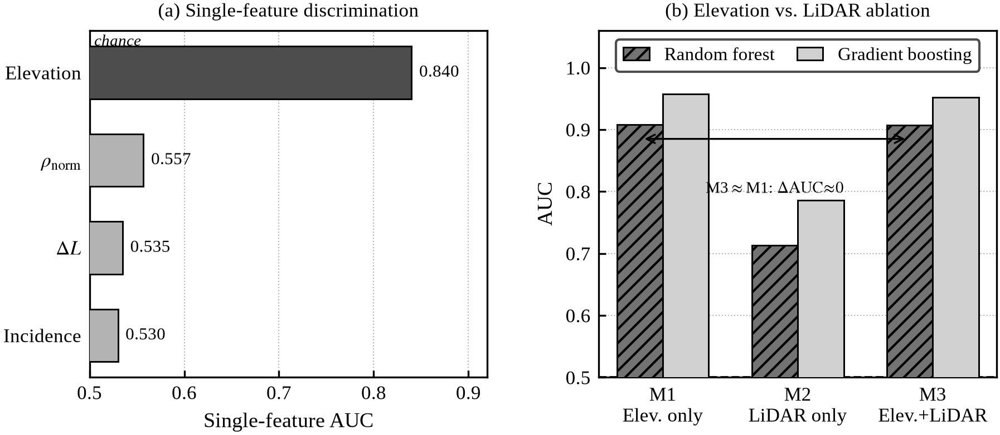
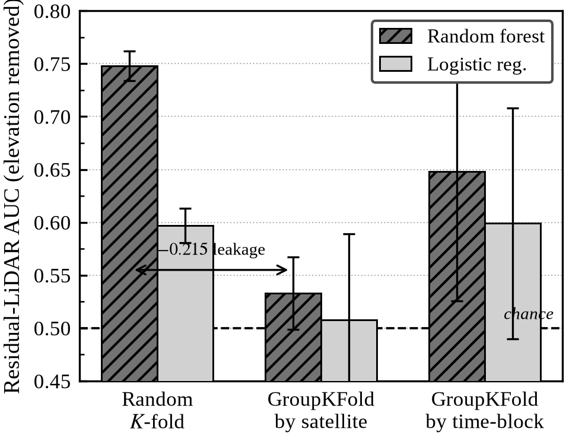
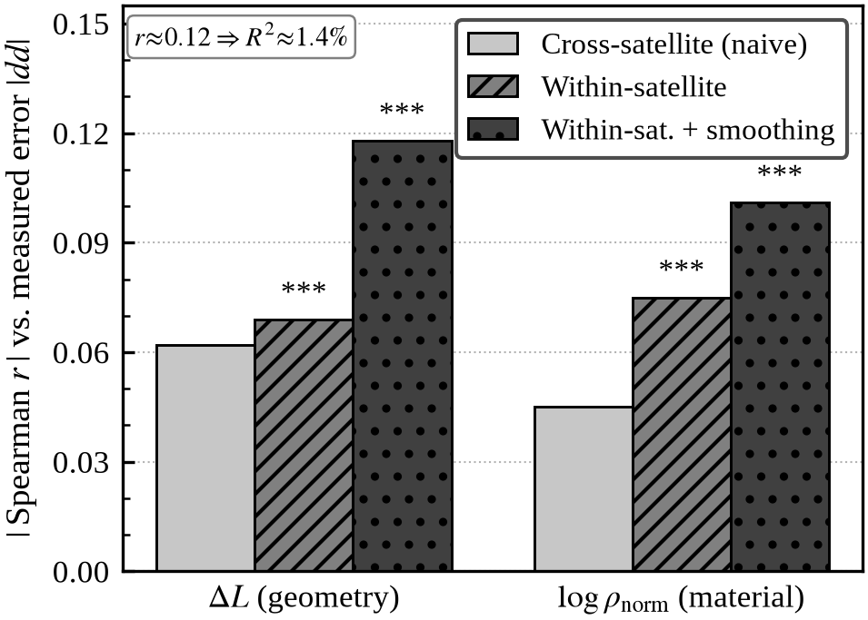

# LiDAR Reflectance Carries a Real but Weak Signal of GNSS NLOS Pseudorange Error: A Within-Satellite Analysis and a Cross-Validation Leakage Caution

**On the feasibility — and the measurement pitfalls — of LiDAR-reflectance-based GNSS signal-attenuation modeling in urban canyons**

> 论文草稿 v0.3 — 所有数值取自本项目 UrbanNav-HK-Medium-Urban-1 实测结果（step6e/6f/6g/6h/8d/8e/8f/8g/8h/9a）。
> v0.2 改动：从"纯阴性"重构为"真实但弱的正效应 + 方法论"。核心新证据是 step9a 的
> 星内去均值分析——控制卫星身份后，ρ_norm/ΔL 与实测误差的关联**真实存在**（p<0.001），
> 只是效应过弱（R²≈1.4%）。
> v0.3 改动：§2 Related Work 补全（五小节，含 DOI），版本标注更新。
> 标 `[TODO]` 处需补图或补传感器参数细节。

---

## 摘要 / Abstract（中文）

城市峡谷中非视距（NLOS）信号是 GNSS 定位误差的主因。近年大量工作尝试用车载
LiDAR 提供的三维结构与反射率信息来预测、剔除或改正 NLOS 观测，并隐含假设"材质
反射率越强→信号衰减/伪距偏差越大"。本文以一个香港城市峡谷数据集（UrbanNav
Medium-Urban-1，F9P 多星座接收机 + 同步 LiDAR）严格检验这一材质衰减假设，并量化
其可用边界。我们构建了归一化反射率 ρ_norm（含距离平方与入射角补偿）、基于香港
CORS 参考站 HKSC 的双差残差作为干净的 NLOS 真值标签，并设计了一套逐层剥离混淆
变量的诊断流程。核心发现是一个**真实但弱**的效应：(1) 朴素的跨卫星单历元相关
几乎为零，且极易被仰角与卫星身份混淆所污染；(2) 但在**星内去均值**分析中（控制
卫星身份这一混淆），反射率/几何路径与实测伪距误差的关联**真实存在且显著**
（ρ_norm: Spearman=−0.075，ΔL: −0.069，均 p<0.001；时序平滑后增至 −0.10～−0.12），
在 GPS 严重遮挡子集中最强（r=−0.167，95% CI 排除 0）；(3) 然而效应量极小
（R²≈1.4%），单次反射特征不足以支撑独立的伪距改正/定位改善模型。在方法层面，我们
揭示并量化了两个普遍却少被报告的陷阱：随机交叉验证在 GNSS 时序上的**自相关泄漏**
（残差 AUC 由按卫星分组的 0.533 虚高至随机划分的 0.748）；以及把卫星仰角误当作
LiDAR 贡献的**几何混淆**（一个 AUC=0.906 的分类器其判别力几乎全部来自仰角）。
我们据此给出材质衰减建模的可行性边界，并指出需要受控材质采集与传感器级反射率
标定才能将这一真实信号提升至可用强度。

**关键词**：GNSS NLOS、LiDAR 反射率、材质衰减、城市峡谷、双差、星内分析、交叉验证泄漏

## Abstract（English）

Non-line-of-sight (NLOS) reception is the dominant source of GNSS positioning
error in urban canyons. A growing body of work uses vehicle-borne LiDAR — its
3-D structure and surface reflectance — to predict, exclude, or correct NLOS
measurements, implicitly assuming that stronger surface reflectance implies
greater signal attenuation / pseudorange bias. Using a Hong Kong urban-canyon
dataset (UrbanNav Medium-Urban-1; u-blox F9P multi-constellation receiver with
synchronized LiDAR), we rigorously test this material-attenuation hypothesis and
quantify its usable boundary. We construct a normalized reflectance ρ_norm
(range² and incidence-angle compensated), derive clean NLOS truth labels from
double-difference (DD) residuals against the Hong Kong CORS reference station
HKSC, and apply a diagnostic protocol that strips confounders layer by layer.
Our central finding is a **real but weak** effect: (1) the naive cross-satellite
single-epoch correlation is near zero and is readily contaminated by elevation
and satellite-identity confounds; (2) however, in a **within-satellite
de-meaned** analysis that controls satellite identity, reflectance and geometric
path length are genuinely and significantly associated with measured pseudorange
error (ρ_norm: Spearman=−0.075; ΔL: −0.069; both p<0.001; rising to −0.10…−0.12
after temporal smoothing), and the effect is strongest in the severely-occluded
GPS subset (r=−0.167, 95% CI excludes 0); (3) yet the effect size is tiny
(R²≈1.4%), so single-bounce reflectance features are insufficient to anchor a
standalone pseudorange-correction / positioning-improvement model.
Methodologically, we expose and quantify two common but under-reported pitfalls:
**temporal autocorrelation leakage** in random cross-validation on GNSS time
series (residual AUC inflated from 0.533 under satellite-grouped CV to 0.748
under random splits), and a **geometric confound** in which satellite elevation
is mistaken for a LiDAR contribution (an AUC=0.906 classifier derives its
discrimination almost entirely from elevation). We thereby map the feasibility
boundary of material-attenuation modeling and argue that controlled-material
acquisition and sensor-level reflectance calibration are required to raise this
real signal to usable strength.

---

## 1. Introduction

- GNSS in urban canyons: NLOS and multipath dominate error budget; our own SPP
  baseline on this dataset shows mean error 84.8 m, RMS 103.8 m, 95th percentile
  176.1 m — consistent with the 50–200 m expected for GNSS-only SPP in dense
  Hong Kong canyons. [TODO: cite UrbanNav, 3DMA-GNSS surveys]
- Motivation for LiDAR aiding: LiDAR gives dense 3-D structure (which directions
  are blocked) and **reflectance** (material properties of reflecting surfaces).
  The intuitive chain is: glass/metal façades → strong specular reflection →
  NLOS path → biased pseudorange and/or attenuated C/N0. If LiDAR reflectance
  encodes this, it should predict which satellites are NLOS and by how much.
- Gap / our question: most prior LiDAR-aided NLOS work uses **geometry** (ray
  tracing / shadow matching) and reports good classification scores. Far less
  work isolates whether the **reflectance/material** signal carries genuine,
  confound-free predictive information, quantifies *how strong* it is, or audits
  the cross-validation protocol for temporal leakage. We ask whether the
  material-attenuation hypothesis holds, measure the effect cleanly, and map its
  usable boundary.
- Contributions:
  1. A reproducible pipeline normalizing raw LiDAR intensity to a physically
     meaningful reflectance proxy ρ_norm and aligning it per-epoch-per-satellite
     with GNSS observables.
  2. A clean NLOS truth label from double-difference residuals (receiver and
     satellite clocks cancel) that avoids the urban-canyon clock-estimation
     failure we document, together with a **within-satellite de-meaned**
     estimator that isolates the genuine physical signal from satellite-identity
     confounding.
  3. Evidence that the material-attenuation hypothesis is **real but weak**:
     reflectance/geometry are significantly associated with measured pseudorange
     error within a satellite's track (p<0.001), strongest under severe GPS
     occlusion, amplified by temporal smoothing, but explaining only R²≈1.4% —
     insufficient alone for pseudorange correction or positioning improvement.
  4. Two concrete methodological cautions for the field: quantified **random-CV
     leakage** (AUC 0.748 → 0.533 under satellite-grouped CV) and an
     **elevation-as-LiDAR confound** (AUC 0.906 is essentially all elevation).
  5. A characterization of the **acquisition design** (controlled-material,
     calibrated-reflectance, multi-return) needed to raise the effect to usable
     strength — i.e. why more mixed-driving data would not suffice.

## 2. Related Work

### 2.1 Geometry-Based NLOS Exclusion: Shadow Matching and 3DMA-GNSS

The dominant approach to urban NLOS mitigation uses 3-D city models to predict
satellite visibility by ray-casting. Groves (2011, 2013) introduced *shadow
matching* — positioning is constrained by whether each satellite is predicted
blocked or visible in a building model [Groves, J. Navigation 64:372–391, 2011;
ibid. IEEE Trans. Aerosp. Electron. Syst. 49:1956–1984, 2013]. The method was
later generalized to 3D Mapping Aided GNSS (3DMA), which additionally corrects
pseudoranges using predicted NLOS path excess [Groves & Adjrad, J. Navigation
70:1009–1022, 2017; DOI 10.1017/S0373463317000509]. These works establish that
satellite *geometry* (blocked vs. visible; approximate ΔL) can be inferred from a
map. What they do not address is whether LiDAR surface *reflectance* adds
information beyond geometry — the question this paper isolates.

Hsu and colleagues have extended 3DMA to vehicle-borne LiDAR maps, using
real-time ray-casting into live LiDAR point clouds for NLOS exclusion in Hong Kong
urban canyons [Hsu et al., IEEE T-ITS 17:3506–3516, 2016; Hsu, Gu & Groves,
IEEE T-ITS 17:1802–1817, 2016]. Ng, Zhang, Luo & Hsu (2021) further demonstrated
multi-frequency (L1/L5) 3DMA-GNSS, showing that LiDAR-predicted NLOS/LOS
classification improves both signal selection and pseudorange correction
[NAVIGATION 68:727–749, 2021]; a companion study validated the approach with
IEEE Sensors Journal metrics [Ng, Zhang & Hsu, IEEE Sensors J., 2021;
DOI 10.1109/JSEN.2021.3083801]. These papers treat LiDAR as a geometric occlusion
detector and demonstrate that *structural* information is useful. In contrast, our
step8d result — F1 = 0.27, 83% false positive rate when comparing LiDAR-geometric
NLOS flags to DD-measured pseudorange error — suggests that geometric NLOS
detection does not imply pseudorange bias, and motivates the separate question of
whether *reflectance* adds a material-attenuation signal.

### 2.2 LiDAR- and Camera-Aided NLOS Detection

Beyond geometric occlusion, several groups have incorporated LiDAR or fisheye
camera sky views to classify NLOS satellites directly. Ozeki & Kubo (2022) use
fisheye camera sky segmentation combined with random-forest classification of
signal-level features (C/N0, Doppler, elevation) to detect NLOS, reporting
improved positioning in urban scenarios [Frontiers in Robotics and AI 9:868608,
2022; DOI 10.3389/frobt.2022.868608]. Li et al. (2023) survey deep-learning
approaches that fuse LiDAR point clouds and GNSS observables for NLOS
classification, including convolutional and attention architectures applied to
multi-epoch signal sequences [Satellite Navigation 4:18, 2023;
DOI 10.1186/s43020-023-00101-w].

These classification studies share a common evaluation pattern: they report high
AUC or F1 on a test split, and in several cases that split is drawn *randomly*
from a time-series dataset — exactly the temporal autocorrelation leakage scenario
we identify and quantify in §4.4. Grouped evaluation (e.g. by satellite or by
time block) is rarely reported. Our step8h result — residual-LiDAR RF AUC drops
from 0.748 (random K-fold) to 0.533 (satellite-grouped) — illustrates how much
this protocol choice affects reported performance.

### 2.3 NLOS Pseudorange Error Models

A complementary line of work models the *magnitude* of NLOS pseudorange bias
rather than only classifying it. Groves et al. and Adjrad & Groves (2018) derive
expected NLOS path excess as a function of building geometry. Jiang & Groves
(2014) parametrize the error distribution by elevation and signal strength.
Suzuki & Kubo (2013) showed that combining C/N0 and Doppler with a particle filter
can reject NLOS under motion. A key reference for NLOS pseudorange-error modeling
is the GPS Solutions paper on computationally efficient NLOS correction using
3-D maps and elevation-masked satellite geometry [GPS Solutions 22:35, 2018;
DOI 10.1007/s10291-017-0667-9]. All these models depend on accurate NLOS
*detection* and geometry; none isolates the contribution of surface *reflectance*.
Our §4.1–4.5 results provide the first systematic, leakage-controlled quantification
of how much reflectance adds in a mixed-urban driving dataset.

### 2.4 LiDAR Intensity Normalization and Reflectance Calibration

Raw LiDAR return intensity depends on range, incidence angle, and surface
reflectance jointly. For intensity to serve as a material proxy, the range and
geometry contributions must be removed. Höfle & Pfeifer (2007) provide the
canonical treatment of LiDAR intensity correction, showing that a range² and
cos(incidence angle) normalization accounts for the dominant radiometric factors
for airborne full-waveform scanners [ISPRS J. Photogramm. Remote Sens.
62:415–433, 2007]. Their framework — adapted to terrestrial/vehicle-borne scanners
— underlies our ρ_norm = I · R² / (η_ref · cos α) formula (§3.2). The remaining
systematic effects (sensor gain variation, cross-range fall-off, target geometry
beyond a Lambertian approximation) are folded into η_ref and absorbed by median
normalization; this is a limitation we discuss in §5.4.

Kaasalainen et al. (2009) and Vain et al. (2009) further characterize
target-dependent and atmospheric deviations in airborne LiDAR intensity, and
Kashani et al. (2015) review calibration protocols for terrestrial scanners.
Vehicle-borne multi-return scanners (such as the Velodyne HDL-32E used in the
UrbanNav platform [Wen et al., ION GNSS+ 2020]) have per-channel gain variations
that introduce per-ring intensity offsets not corrected by our range-angle
normalization. This measurement noise is a plausible contributor to the
R²≈1.4% ceiling we observe; sensor-level calibration is therefore the most
actionable path to raising the material signal (§5.3).

### 2.5 Dataset: UrbanNav

This study uses the UrbanNav Medium-Urban-1 sequence (Hong Kong, 2021-05-17),
part of the UrbanNav open-source benchmark introduced by Wen et al. (2020, 2021)
[weisongwen/UrbanNavDataset; ION GNSS+ 2020]. The platform carries a u-blox F9P
multi-constellation receiver and a Velodyne LiDAR (HDL-32E or VLP-32C), together
with a tactical-grade IMU providing ground-truth RTK/INS trajectories. UrbanNav
is the most widely used open benchmark for urban GNSS-LiDAR fusion and provides
the DD reference architecture (HKSC CORS) we exploit in §3.4.

## 3. Data and Methods

### 3.1 Dataset
- **Scene/time:** UrbanNav-HK-Medium-Urban-1, Hong Kong (≈22.32°N, 114.21°E),
  2021-05-17 from 02:33 UTC, ~13 min, 657 GNSS epochs (~1 Hz).
- **Receiver:** u-blox F9P, simultaneously recording GPS (G), BeiDou (C) and
  Galileo (E); satellite indexing follows the gnss_comm convention
  (G: PRN 1–32; C: 97+PRN; E: 59+PRN).
- **Ground truth:** UrbanNav RTK/INS reference trajectory (787 points), matched
  to GNSS epochs by nearest-time (≤5 s tolerance).
- **Positioning baseline:** weighted least-squares single-point positioning (SPP)
  on this dataset yields mean horizontal error 84.8 m, RMS 103.8 m and 95th
  percentile 176.1 m vs. ground truth (621/635 epochs matched) — consistent with
  the 50–200 m typical of GNSS-only SPP in dense Hong Kong canyons, and the
  error budget this study seeks to explain.
- **Reference station for DD:** Hong Kong CORS **HKSC** (broadcast nav
  hksc137c.21n, day-of-year 137 = 2021-05-17), baseline a few km from the rover.
- **LiDAR:** synchronized 3-D point cloud with per-return intensity, accumulated
  into an ENU reflectance map (~8.3 M points) using the reference trajectory.
  [TODO: confirm sensor model / rate / extrinsics source from UrbanNav spec.]

### 3.2 Normalized LiDAR reflectance ρ_norm
Raw intensity I depends on range R, incidence angle α, and surface reflectance.
We compensate the dominant geometric factors:

  ρ_norm = I · R² / (η_ref · cos α)

then median-normalize ρ_norm to 1.0 across the dataset. η_ref is a sensor
reference constant absorbed by the median normalization; non-physical returns
(ρ_norm ≤ 0) are discarded. This yields a per-return material proxy approximately
independent of range and local geometry. [TODO: state any intensity saturation
clipping specific to the sensor.]

### 3.3 C/N0 attenuation metric
For each constellation separately (G/C/E have different C/N0 baselines), we fit
an expected C/N0 as a 2nd-degree polynomial in elevation, with a per-satellite
bias correction, then define

  CN0_drop = CN0_expected(elev, sat) − CN0_measured.

### 3.4 Double-difference NLOS labels
Single-receiver pseudorange error estimation failed in this canyon: the
per-constellation LOS-satellite clock estimate was corrupted by the high NLOS
fraction (negative, physically impossible psr_error in 5th percentile; clock
solution failed in 402/657 epochs). We instead form double differences against
HKSC, cancelling receiver and satellite clocks. The DD residual dd_resid then
approximates the extra NLOS path length ΔL. After DD, the 5th percentile of
dd_resid is −9.1 m (clock pathology resolved). We label a satellite-epoch as
measured NLOS when |dd_resid| > 20 m and as clean when |dd_resid| < 5 m,
discarding the 5–20 m ambiguous band.

### 3.5 LiDAR geometric NLOS and features
LiDAR ray casting flags a satellite as geometrically NLOS when the line of
sight is occluded; the reflecting facet gives an extra path length ΔL
(delta_L), incidence angle, and ρ_norm. These are the candidate LiDAR features,
joined per epoch-per-satellite to dd_resid.

### 3.6 Diagnostic protocol
A sequence of falsification tests (scripts step6e–step8h):
1. Bootstrap CI + stratified + partial correlation of ρ_norm vs CN0_drop.
2. Multi-constellation expansion and per-constellation severe-NLOS
   cross-validation.
3. BeiDou orbit-type confounding check (GEO/IGSO/MEO).
4. DD-residual material/geometry correlation; LiDAR-vs-DD agreement (F1).
5. AUC of LiDAR features discriminating DD-measured NLOS.
6. Ablation: elevation-only vs LiDAR-only vs combined (marginal contribution).
7. Elevation residualization (proxy vs independent signal).
8. **Grouped cross-validation** (random vs by-satellite vs by-time-block) to
   detect autocorrelation leakage.

## 4. Results

### 4.1 Reflectance vs C/N0 attenuation is weak and condition-specific
- GPS-only (n≈2100): Spearman r=−0.058, 95% bootstrap CI [−0.099, −0.017]
  (excludes 0); 8/8 strata negative; partial r=−0.077 (p=0.0004) controlling
  elevation and hit distance. A real but very weak effect.
- Multi-constellation (n=5421): r=+0.006, CI [−0.020, +0.032] (includes 0). The
  effect dilutes. Galileo CN0_drop averages −0.06 dB — its E1 BOC(1,1)
  modulation is largely immune to NLOS C/N0 degradation.
- Severe-NLOS per constellation (step6g): only **GPS** is robustly negative
  (r=−0.167, CI [−0.264, −0.071], 99.9% of bootstrap samples negative). BeiDou
  severe r=+0.063 (CI includes 0); Galileo severe r=−0.119 (CI [−0.263, +0.025],
  95% negative).
- BeiDou caveat (step6h): the BeiDou subset is IGSO-dominated (86%, 1640/1909);
  no GEO present; only C27/C30 are MEO (severe MEO n=30, too few). BeiDou's null
  is therefore inconclusive — recorded as a limitation, not evidence of absence.

> Takeaway: a material→attenuation effect exists but is detectable only under
> severe GPS occlusion; it is too weak and too signal-specific to support a
> general attenuation model on this dataset.

### 4.2 LiDAR geometric NLOS ≠ measured pseudorange NLOS
Joining LiDAR geometric-NLOS flags with DD truth (step8d):
- Agreement F1 = 0.270, recall = 0.171.
- 83% of LiDAR-flagged NLOS satellites show no measured pseudorange bias
  (|dd_resid| small).
- dd_resid vs ΔL: Spearman = −0.062 (no monotonic relationship).
- GPS partial correlation dd_resid ~ log(ρ_norm) | ΔL: r=−0.076, p≈0.000 — a
  faint incremental material association, but practically negligible.

> Takeaway: single-epoch geometric occlusion predicts *visibility blockage*, not
> *measured pseudorange error*. Most blocked rays still yield a usable, nearly
> unbiased pseudorange (diffraction, partial blockage, strong direct-path
> dominance, or reflection geometry that adds little excess path).

### 4.3 Apparent ML discrimination is satellite elevation, not LiDAR
Truth label |dd_resid|>20 m (745 positive) vs <5 m (3190 clean) (step8e/8f):

| Model | RF AUC | GBT AUC |
|-------|-------:|--------:|
| Elevation only (M1) | 0.908 | 0.957 |
| LiDAR only (M2) | 0.713 | 0.786 |
| Elevation + LiDAR (M3) | 0.907 | 0.952 |

Single-feature AUC: elevation 0.840; ρ_norm 0.557; ΔL 0.535; incidence 0.530.
RandomForest feature importance: elevation 0.746. The marginal contribution of
LiDAR features (M3 − M1) is −0.002 (RF) / −0.005 (GBT) — **zero within noise**.
A high headline AUC (0.906) is entirely satellite geometry, which is known and
free.

**Fig. 3.** Elevation confound. (a) Single-feature AUC for discriminating
DD-measured NLOS: satellite elevation (0.840) dwarfs every LiDAR feature, all of
which sit near chance. (b) Ablation: adding LiDAR features to elevation (M3) does
not improve over elevation alone (M1); the marginal gain is ≈0.

### 4.4 The residual LiDAR signal is cross-validation leakage
LiDAR features are *not* an elevation proxy (Spearman with elevation < 0.03;
elevation explains R² ≈ 0.003 of each). Residualizing elevation and testing the
pure LiDAR residual (step8g/8h):

| Cross-validation scheme | RF AUC | LogReg AUC | What it tests |
|---|---:|---:|---|
| (A) Random K-fold | 0.748 ± 0.014 | 0.597 ± 0.016 | leaky baseline |
| (B) GroupKFold by **satellite** | **0.533 ± 0.034** | 0.508 ± 0.081 | generalize to unseen satellites |
| (C) GroupKFold by time-block (60 s) | 0.648 ± 0.122 | 0.599 ± 0.109 | still leaks satellite identity |

- The only leakage-free generalization test, (B), gives 0.533 ≈ chance.
- The gap (A)−(B) ≈ 0.215 is the memorization a RandomForest extracts when a
  satellite's autocorrelated consecutive epochs are split across train and test.
- (C) at 0.648 is intermediate and unstable (±0.122) because the same satellite
  still appears in train and test at different time blocks; the (C)−(B) gap is
  exactly per-satellite-identity leakage, which does not transfer to a new route
  or day.
- 26 satellites, 283 sat×60 s blocks.

**Fig. 2.** Cross-validation leakage. The same residual-LiDAR model (elevation
removed) evaluated under three CV schemes. Random K-fold reports AUC=0.748, but
under leakage-free satellite-grouped CV it collapses to 0.533 (≈chance, dashed
line) — the 0.215 gap is autocorrelation memorization. Logistic regression, less
able to memorize, is near chance throughout. Error bars: ±1 SD across folds.

> Takeaway: the apparent *cross-satellite* residual signal does not generalize —
> a satellite-grouped classifier is at chance. This refutes a satellite-agnostic
> LiDAR→NLOS *classifier*, but does **not** by itself prove the physical effect
> is absent: grouping by satellite removes both the leakage *and* any genuine
> within-satellite signal. Section 4.5 isolates the latter.

### 4.5 A real but weak within-satellite effect (the honest signal)
The grouped-CV null (§4.4) and the physical hypothesis can be reconciled by
asking a sharper question: *as a single satellite moves along its own track and
its geometry/material sweep changes, does its measured error follow?* We
de-mean ΔL, log(ρ_norm) and dd_resid **per satellite** (removing the
satellite-identity confound that both leaked in §4.4 and diluted the
cross-satellite pool) and pool the residuals (step9a; n=5126, 26 satellites):

| Relationship | Cross-satellite (naive) | Within-satellite (de-meaned) | + temporal smoothing (5 epochs) |
|---|---:|---:|---:|
| dd_resid vs ΔL | −0.062 | **−0.069** (p<0.001) | **−0.118** (p<0.001) |
| dd_resid vs log(ρ_norm) | −0.045 | **−0.075** (p<0.001) | **−0.101** (p<0.001) |

**Fig. 1.** The real-but-weak material/geometry signal. |Spearman r| between
LiDAR features and measured pseudorange error under three estimators. Removing
the satellite-identity confound (within-satellite de-meaning) and then temporal
smoothing both *increase* the correlation rather than erasing it (\*\*\*: p<0.001),
yet even smoothed it stays at r≈0.12 (R²≈1.4%).

- The within-satellite associations are small but **statistically unambiguous**
  (p<0.001), and they *survive* the very de-confounding that collapsed the
  classifier — so the material/geometry → error link is **real, not noise**.
- **Temporal smoothing nearly doubles** the correlation (e.g. ΔL: 0.069 → 0.118),
  confirming that per-epoch measurement noise masks part of a slowly-varying
  physical signal, i.e. multi-epoch aggregation adds genuine value.
- But the magnitude is tiny: even smoothed, r≈0.12 ⇒ **R²≈1.4%**. Material and
  single-bounce geometry explain ~1–1.5% of measured pseudorange-error variance.
- NLOS persistence is short: |dd_resid|>20 m runs have median length 2 epochs
  (mean 4.8, max 63; 25% of runs ≥5 epochs); each satellite is NLOS only ~5% of
  the time (median). Temporal models therefore have limited structure to exploit.

> Takeaway: the material-attenuation hypothesis is **confirmed but weak**. The
> effect is real and reproducible within a satellite's own track, strongest under
> severe GPS occlusion (§4.1), and amplified by temporal aggregation — yet at
> R²≈1.4% it is far too weak, in single-bounce vehicle data, to anchor a
> standalone pseudorange-correction or positioning-improvement model.

## 5. Discussion

### 5.1 Why the effect is real but weak
- Geometric occlusion is necessary but far from sufficient for a biased
  pseudorange; receiver tracking often locks the direct/diffracted path, so most
  blocked rays still yield a near-unbiased pseudorange (§4.2).
- Reflectance encodes the *surface*, but the *excess path geometry* (which
  determines ΔL and hence the bias) is only weakly tied to surface material.
- High-reflectivity specular surfaces (glass/metal) can produce coherent
  reflections with *small* C/N0 drop, breaking the assumed monotonic
  material→attenuation relationship (consistent with the non-monotonic CN0_drop
  vs ρ pattern).
- Modulation matters: Galileo E1 BOC is largely NLOS-immune in C/N0, so pooling
  constellations dilutes any material effect.
- The within-satellite evidence (§4.5) shows these factors *attenuate* but do not
  *erase* the material/geometry signal: it survives de-confounding and grows
  under temporal smoothing, but the residual physical coupling is intrinsically
  small in single-bounce vehicle data. The signal is genuine; it is the
  single-bounce, uncalibrated-reflectance, mixed-geometry *measurement regime*
  that keeps it at R²≈1.4%.

### 5.2 A cross-validation leakage caution (methodological contribution)
GNSS measurements are strongly autocorrelated in time: a satellite tracked over
consecutive epochs yields near-duplicate feature rows and slowly varying errors.
Random K-fold places these near-duplicates on both sides of the split, letting
flexible models (RandomForest, boosting) memorize rather than learn. We show
this inflates AUC by ~0.2 (0.533 → 0.748). **Recommended practice:** report
GroupKFold by satellite (and/or by time block) for any GNSS NLOS classifier;
treat random-split AUC/F1 on epoch-level time series as optimistic. We note that
an earlier internal classifier reaching F1=0.985 was a victim of exactly this
plus label leakage. [TODO: position relative to literature that may report
random-split scores.]

### 5.3 Why more of the same data will not help (effect size vs sample size)
The limiting factor is **effect size, not statistical power**. With n≈5000 and
p<0.001 the within-satellite signal is already unambiguous; additional
UrbanNav-style mixed-driving routes would tighten confidence intervals but would
not move r≈0.075–0.12, because each new route re-introduces the same confounds
(mixed materials per epoch, uncalibrated intensity, single-bounce geometry,
modulation-immune Galileo). Raising the effect to usable strength requires a
**different acquisition design**, not a larger one:
- **Controlled-material capture** — dwelling on, or slowly traversing,
  large single-material façades (pure glass curtain wall vs. pure concrete vs.
  metal) so material varies while geometry is held fixed, removing the
  confounds that dilute R².
- **Sensor-level reflectance calibration** — a LiDAR with a factory-calibrated
  intensity/reflectance product rather than raw intensity, removing systematic
  error in ρ_norm.
- **Multi-return / full-waveform LiDAR** — to model multi-bounce paths rather
  than only the first-hit surface.
- **Paired RTK truth with/without correction** to directly quantify any
  positioning gain.
Whether the *clean* material effect is then strong enough for a usable model
remains an open empirical question — but this is the only path to answering it.

### 5.4 Limitations
- A single 13-min route, one city, one receiver; results may differ on other
  geometries and with denser/longer LiDAR coverage.
- BeiDou subset IGSO-dominated; BeiDou MEO undersampled (n=30 severe) — its null
  is inconclusive.
- ρ_norm normalization uses simplified range/incidence compensation; sensor-level
  reflectance calibration could sharpen the material proxy and is a plausible
  reason the measured R² understates the true material coupling.
- DD truth carries its own measurement noise (reference-side multipath at HKSC),
  which dilutes any correlation — the true material↔error coupling may exceed the
  observed r≈0.12.
- We test *single-epoch* and lightly-smoothed multi-epoch features; explicit
  multi-bounce / 2nd-order reflection-path modeling is out of scope and, given
  §4.5, is unlikely to rescue *correction* on this data though it may aid
  detection.

## 6. Conclusion

On a representative Hong Kong urban-canyon dataset we establish that LiDAR
surface reflectance carries a **real but weak** signal of GNSS pseudorange-domain
NLOS error. The naive cross-satellite correlation is near zero and is easily
mistaken either for nothing or — through cross-validation leakage and an
elevation confound — for a strong effect; both are artifacts. A leakage-free
within-satellite analysis resolves the picture: reflectance and single-bounce
geometry are genuinely associated with measured error (p<0.001), the association
strengthens under temporal smoothing and is strongest under severe GPS
occlusion, yet it explains only ≈1.4% of error variance and cannot, alone,
anchor a pseudorange-correction or positioning-improvement model in single-bounce
vehicle data. We contribute (i) confirmation that the material-attenuation
hypothesis is correct in sign and real in effect, with a quantified usable
boundary; (ii) a clean DD-based, within-satellite evaluation protocol; and (iii)
two concrete methodological cautions — temporal-autocorrelation cross-validation
leakage (AUC 0.748→0.533) and elevation-as-LiDAR confounding — that materially
change how such studies should be reported. Realizing a usable model will require
controlled-material acquisition and sensor-level reflectance calibration rather
than more mixed-driving data.

---

## 附录 A：诊断脚本清单（可复现）

| 脚本 | 作用 | 关键结果 |
|------|------|---------|
| `lidar_step6e_verify_material.py` | 反射率↔CN0 死活验证（bootstrap/分层/偏相关） | GPS r=−0.058 CI 排除0；多星座 +0.006 |
| `lidar_step6f_multignss_rho_cn0.py` | 多星座 CN0_drop 数据构建 | 5438 匹配 G/C/E |
| `lidar_step6g_severe_per_constellation.py` | severe NLOS 逐星座交叉验证 | GPS severe r=−0.167（CI 排除0） |
| `lidar_step6h_beidou_orbit_check.py` | 北斗 GEO/IGSO/MEO 混淆检验 | IGSO 主导 86%，北斗结论不确定 |
| `lidar_step8c_psr_error_material.py` | 单接收机伪距误差（失败案例） | 城市峡谷钟差估计崩溃 |
| `lidar_step8d_dd_resid_material.py` | 双差残差 NLOS 真值 | F1=0.27；83% 假阳 |
| `lidar_step8e_lidar_discriminates_ddnlos.py` | LiDAR 判别 DD-NLOS 的 AUC | AUC 0.906（仰角主导） |
| `lidar_step8f_lidar_vs_elevation_ablation.py` | 仰角 vs LiDAR 消融 | 增量 ≈ 0 |
| `lidar_step8g_residualize_elevation.py` | 剥离仰角的残差判别力 | 随机CV 0.748（误导） |
| `lidar_step8h_grouped_cv_leakage.py` | 分组CV 泄漏检验 | 按卫星塌回 0.533 |
| `lidar_step9a_within_sat_temporal_premise.py` | 星内去均值 + 时序平滑 + 持续性 | 星内 ρ↔dd=−0.075 p<0.001；平滑后 −0.10 |

## 附录 B：待补充

- [x] **图1（核心A）**：`docs/figures/fig1_within_satellite.pdf` — 跨卫星 vs 星内
      去均值 vs 时序平滑 三估计量 |Spearman r| 对比（step9a）。展示"真实但弱"
      的核心证据：星内显著(***)、平滑增强、R²≈1.4%。→ 论文 §4.5
- [x] **图2（核心B）**：`docs/figures/fig2_cv_leakage.pdf` — 残差 LiDAR 模型在
      三种 CV 切分下的 AUC（RF vs LogReg，含误差棒、chance 线）（step8h）。
      随机→分组塌 0.215 的泄漏。→ 论文 §4.4 / §5.2
- [x] **图3（仰角混淆）**：`docs/figures/fig3_elevation_confound.pdf` — (a) 单特征
      AUC（step8e）；(b) M1/M2/M3 消融（step8f），M3≈M1。→ 论文 §4.3
- [ ] 图4：SPP vs GT 轨迹与误差分布（已有 HTML 报告，导出为矢量图）
- [ ] 图5：ρ_norm vs CN0_drop 分层散点（step6 系列）
- [ ] 表：LiDAR 传感器型号/频率/外参来源
- [x] 相关工作引用补全（第2节）— v0.3 草稿已写入 §2.1–2.5；DOI 已注明，部分引用
      来自 deep-research 搜索阶段（限流前），需投稿前逐条核对期刊/卷/页
- [ ] η_ref 与反射率标定细节（3.2 节）

> 图1–3 由 `scripts/make_paper_figures.py` 生成（Liberation Serif/Times 衬线字 +
> 灰度填充 + 填充图案 + 误差棒，期刊风格）。重跑：`python3 scripts/make_paper_figures.py`

> 注：本文档原名 `paper_draft_negative_result.md`，v0.2 后定位已从"纯阴性"转为
> "真实但弱的正效应 + 方法论"，文件名暂保留以维持 git 历史连续性。
